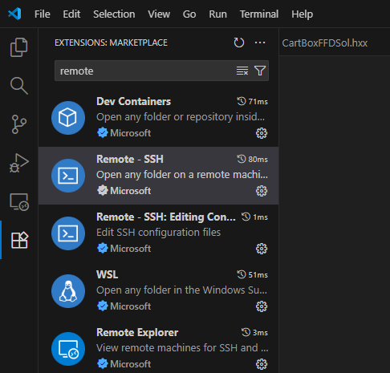
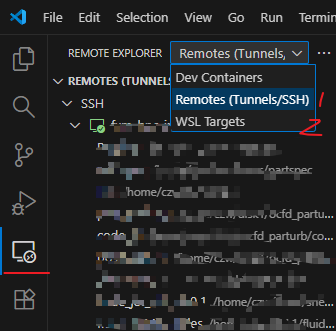
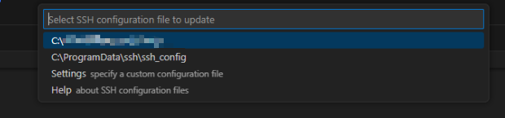
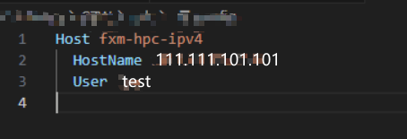
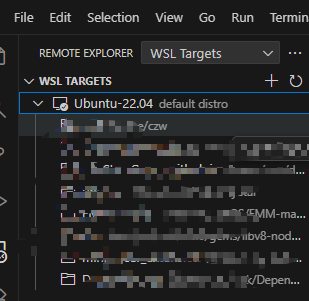
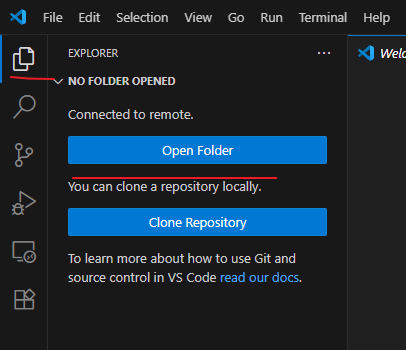

# 新手指南
1. 是否了解什么是Linux系统？不了解，可参考 https://www.runoob.com/linux/linux-tutorial.html
2. 是否拥有Linux服务器，比如Ubuntu系统？
    1. 如果没有，但使用的是windows系统，可以自行安装WSL，可参考[Windows 11 安装WSL2 子系统](https://www.notion.so/Windows-11-WSL2-2a1add39c28c8098b19fc360e44d4c3e?pvs=21) 
    2. 如果拥有，请记住服务器的IP地址
3. 以[VSCode](https://code.visualstudio.com/)作为示例，开启VSCode后，在左侧应用栏目，安装Remote-ssh 与 WSL：
    
    
    
    1. 点击左侧栏目远程图标
        
        
        
        - 如果为远程服务器，选择“1”-“Remotes(Tunnels/SSH)”,  再点击SSH末尾处的+号，新增远程登录途径
            
            
            
            按照提示，比如以test为用户名，ip地址为111.111.101.101（该用户名与ip地址仅为示例，以实际拥有的远程服务器ip为准），可以输入 ssh test@111.111.101.101 -A
            
            
            
            选择配置文件存储位置（默认即可）
            
            
            
            如果需要修改ssh配置，可以点击SSH的齿轮设置符号，可以在配置文件位置修改参数
            
            
            
            可以根据需求，修改配置参数内容；如果需要新增连接，可以参考模板进行添加即可：
            
            
            
            点击箭头，或者新建窗口连接，就可以连接到远程服务器了
            
            
            
        - 如果为本地WSL2 系统，选择“2”-“WSL Targets”,  在列表中选择后，即可进入
            
            
            
    2. 按照提示，输入密码，即可进入。可以在左侧文件浏览栏目，打开文件夹。根据提示输入相应文件的路径即可在左侧观察到路径中的文件
        
       
        
    3. 可以尝试点击不同文件，查看一下文件内容。
    4. 点击菜单栏目中Terminal->new terminal， 会在vscode底部打开命令行窗口，其与putty功能一样。


## 环境配置
需要在系统中提前安装Conda或者miniConda。对于常见的超算，一般自带conda，需要自行向管理员咨询。如果服务器没有安装Conda，可以参考如下步骤：
### Conda 安装
1. 最新版本的 miniconda 可通过以下链接下载
```
    wget https://repo.anaconda.com/miniconda/Miniconda3-latest-Linux-x86_64.sh
```
如果服务器网络不太好，可以手动下载
  - 官方网站：https://repo.anaconda.com/miniconda/Miniconda3-latest-Linux-x86_64.sh
  - 清华镜像：https://mirrors.tuna.tsinghua.edu.cn/anaconda/miniconda/Miniconda3-latest-Linux-x86_64.sh

2. 在个人路径下安装miniconda
```
    mkdir -p ~/miniconda3
    bash Miniconda3-latest-Linux-x86_64.sh -b -u -p ~/miniconda3
```
3. 加载conda环境
```
    source ~/miniconda3/bin/activate
```
4. 测试conda环境是否加载成功
```
    conda init --all
```
5. 如果要卸载conda
```
    conda deactivate
```

### PhyStar环境
下载PhyStar源码的方式有很多，可以自行在GitHub上下载，也可以通过git clone命令，也能使用提供的zip文件。假设大家下载到源码，并把源码解压到某个服务器路径，在命令行输入

```
    bash /path/to/phystar/phystar-envs.sh
```
其中/path/to/phystar/ 需要替换场PhyStar根目录， 如果已经在PhyStar的根目录，路径为空，或者./ 均可。此时，会自动根据程序所需，下载相应的依赖包。

每次打开命令行使用PhyStar时，可以输入
```
    conda activate phystar-envs
```
即可加载PhyStar所需要的环境。


## 运行


### slurm集群
由于Conda无法在slurm系统的后台提交中激活，需要在sbatch文件中添加如下命令：
```
module load  conda/miniconda3 
CONDA_SH=$(dirname $(dirname $(which conda)))/etc/profile.d/conda.sh #找到conda.sh的路径
source $CONDA_SH # 运行conda
conda activate phystar-envs # 加载环境变量
```

