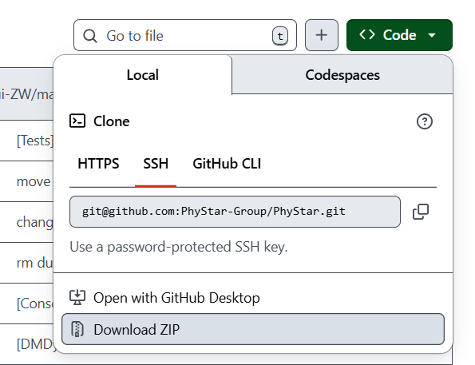

# 快速开始

该程序需要在Linux命令行中进行运行，因此需要掌握Linux的基本知识。如果不熟悉Linux系统，可以参考[新手指南](../fresher-guide/index.md)。


## 下载程序

从PhyStar-Group的GitHub开发群组，并进入[PhyStar](https://github.com/PhyStar-Group/PhyStar)仓库中，点击Code->Download ZIP 即可下载。   
    
 由于代码并未开源，需要加入PhyStar-Group的Developer开发群组，才能正常进入仓库下载。如果仓库不可见，请联系cuizhiwen@hnu.edu.cn

将安装包复制到适当的Linux目录中，运行下面命令进行解压

```
unzip PhyStar-main.zip
```

进入解压后的目录

```
cd PhyStar-main
```

## 环境配置

如果是第一次使用，可能没有conda，可以按照如下步骤安装。如果已经安装过，可以跳过下一步。

### Conda安装

#### 下载安装包

最新版本的 miniconda 可通过以下链接下载

```
    wget https://repo.anaconda.com/miniconda/Miniconda3-latest-Linux-x86_64.sh
```

如果服务器网络不太好，可以手动下载

- 官方网站：https://repo.anaconda.com/miniconda/Miniconda3-latest-Linux-x86_64.sh
- 清华镜像：https://mirrors.tuna.tsinghua.edu.cn/anaconda/miniconda/Miniconda3-latest-Linux-x86_64.sh

如果Linux系统版本太低，最新版本安装失败，可以下载历史版本https://repo.anaconda.com/miniconda/

目前，在ubuntu 22.04上可以使用：https://repo.anaconda.com/miniconda/Miniconda3-py39_25.1.1-1-Linux-x86_64.sh


#### 安装过程

在个人路径下安装miniconda

```
    mkdir -p ~/miniconda3
    bash Miniconda3-latest-Linux-x86_64.sh -b -u -p ~/miniconda3
```

加载conda环境

```
    source ~/miniconda3/bin/activate
```

测试conda环境是否加载成功

```
    conda init --all
```

一般在激活后，会在用户名前面增加`(base)` 标签。

## PhyStar环境自动配置

在PhyStar的根目录下，运行如下命令：

```
bash phystar-envs.sh
```

配置结束后，使用时通过如下命令**激活**或**去激活**环境，激活后，命令行用户名前会出现`(phystar-envs)`标签

```
conda activate phystar-envs # 激活环境
conda deactivate            # 去激活
```

可以检查现在的环境是否能正确使用，

```
which mpirun
```

如果输出的mpirun的使用路径不是系统的，而是conda路径中的，即说明配置成功，比如/home/czw/.conda/envs/phystar-envs/bin/mpirun

### 更新配置

如果配置文件`etc/phystar-envs.yml` 有内容更新，可以通过下面命令更新环境

```
conda env update -f phystar-envs.yml --prune
```


## 运行算例

### 以cartboxfdm为例

进入Apps/simpleflow目录， 并新建build目录

```shell
cd Apps/cartboxfdm
mkdir build
```

进入build目录，进行cmake

```shell
cd build
cmake ..
```

编译

```shell
make -j
```

将runscript_shear中所有文件，copy到build目录中

```shell
cp -r ../runscript/* .
```

适当修改*.toml 文件中的值

运行

>  核数根据实际情况选择，一般总核数为`ControlDict.toml`文件中 `MPI.Procs`中各方向并行核数的乘积

```shell
 mpirun -np 16 ./cartboxfdm
```
